# Implementation of Product Supplychain using Ethereum Smart Contract

This project showcases the journey of product beans on blockchain. 

The product supply chain is the sequence of activities and process  to bring raw product beans from product farms to processed product in markets. 

#### Problems in Existing System
---

- Currently Product trade mostly relies on fax machines and emails to send and recieve contracts across the globe, resulting into slower and error prone paper work.

- Blockchain can solve this by providing immutable and verifiable data sources

		
 

#### What we are providing?
---

- We have implemented smart contract addressing the issue of storing critical data necessary at different stages of supplychain and making it verifiable by all stakeholders in supplychain.


#### Application Workflow Diagram
---


#### In this application we have Six stages
---

1. Admin
2. Farm-Inspector
3. Manufacturer
4. Exporter
5. Importer
6. DeliveryHub

**Admin :** Admin creates new batch which is initial stage of product batch.

**Farm-Inspector :**  Farm-inspectors are responsible for inspecting product farms and updating the information like product family, type of seed and fertilizers used for growing product.

**Manufacturer :** Manufacturers conducting plucking, hulling , polishing , grading and sorting activities, further updating the information of crop variety, temperature used and humidity maintained during the process.

**Exporter :** Exporters are the organization who exports product beans throughout the world. Exporter  adds quantity, destination address, ship name, ship number , estimated date and time and exporter id.

**Importer :** Importers imports the product from product suppliers and  updates quantity, ship name, ship number , transporters information, warehouse name, warehouse address and the importer's address.

**DeliveryHub :** DeliveryHubs are the organizations who processes raw product beans by roasting them on particular temperature and humidity and makes it ready for packaging and to sale into markets. DeliveryHub adds the information like quantity, temperature , roasting duration , internal batch number , packaging date time, deliveryHub name and deliveryHub address.

#### Included Components
---
-  Solidity (Ethereum)
-  Metamask  (Ethereum wallet)
-  Rinkeby test network ( use rinkeby faucet to get ethers on rinkeby network )
-  Infura
-  Truffle
-  IPFS
-  Web3JS
-  Apache and PHP

#### Prerequisites
---
- Nodejs v9.10 or above
- Truffle v4.1.8 (core: 4.1.8) (http://truffleframework.com/docs/getting_started/installation)
- Solidity v0.4.23
- Metamask (https://metamask.io) /Ganache Wallet
> [Please Note : infura.io provider is used for the demo ]

#### Deployment Steps:
---
**Setting up Ethereum Smart Contract:**

```
git clone https://github.com/rwaltzsoftware-org/product-supplychain-ethereum
cd product-supplychain-ethereum/
```

**Update truffle.js **

```
var HDWalletProvider = require("truffle-hdwallet-provider");
module.exports = 
{
    networks: 
    {
	    development: 
		{
	   		host: "localhost",
	   		port: 8545,
	   		network_id: "*" // Match any network id
		},
    	rinkeby: {
    	    provider: function() {
		      var mnemonic = "steel neither fatigue ...";//put ETH wallet 12 mnemonic code	
		      return new HDWalletProvider(mnemonic, "https://rinkeby.infura.io/8U0AE4DUGSh8lVO3zmma");
		    },
		    network_id: '4',
		    from: '0xab0874cb61d.....',/*ETH wallet 12 mnemonic code wallet address*/
		}  
    }
};
```

Go to your project folder in terminal then execute :

```
rm -rf build/
truffle compile 
npm install truffle-hdwallet-provider
truffle migrate --network rinkeby reset
```
**Please note:**
1. After successfully deployment you will get response in bash terminal like below
```
Running migration: 1_initial_migration.js
  Deploying Migrations...
  ... 0x8be4cb8e9c1be61bb83f2661bb8e8a4fefc31433b68137f88a7088a0bb0cccda
  Migrations: 0xd0fc5980df528878573d97e91a11b4196b060174
Saving successful migration to network...
  ... 0x68483eb11712987b190469033e3b12e04bbe960ffbdbfd508eb7618f91ca7dd6
Saving artifacts...
Running migration: 2_deploy_contracts.js
  Deploying SupplyChainStorage...
  ... 0x42bd453f05e530d312c6140a848aa111d08e2edb8ec96bd380e78d1fd0ebc444
  SupplyChainStorage: 0xe544a8f280e4cb111589f935c483cafb1c6044d0
  Deploying SupplyChainUser...
  Deploying ProductSupplyChain...
  ... 0x928fc9e0a4a0c82c0699c8e76247e15af4da9ba7c855735f5db9c8a9d9368575
  ... 0x7d47e86f465584e34db27845d7b8ea6f161ea52566fd92426bdff7e1eb1f6789
  SupplyChainUser: 0x03f72d93e07428dbfbdff8f54676c19dd4421e2b
  ProductSupplyChain: 0x668167b434907e2e212cb7cb7d496159c90b41a4
  ... 0x692205fd39eb4b96184410d2db4b71535ba5813dee16d96d8345de509b811745
  ... 0xd66046eac97c2bedaef7dc63bd88b4a42eec15dcd4d9c4042db7af332c0fda1c
Saving successful migration to network...
  ... 0x1e8684bad65ef2b1b64020eff109984a62099083828c6267970a586096cfa03f
Saving artifacts...

```
- From above responce copy address of SupplyChainStorage, SupplyChainUser, ProductSupplyChain
- This 3 address we need to paste in [product-supplychain-ui/js/app/app.js] file
like below
```
    var globIcoAddress = {
		'ProductMain': "0x668167b434907e2e212cb7cb7d496159c90b41a4",
		'ProductUser': "0x03f72d93e07428dbfbdff8f54676c19dd4421e2b",
		'Storage': "0xe544a8f280e4cb111589f935c483cafb1c6044d0"
	};
```
---
**Setting up UI:**

- Navigate to Apache Document Root in terminal
```
git clone https://github.com/rwaltzsoftware-org/product-supplychain-ui
cd product-supplychain-ui/
```
**For Our Online User Panel Demo:**

- Open http://product-supplychain.rwaltzsoftware.com/user.php

**For Our Online Admin Panel Demo:**

- Open http://product-supplychain.rwaltzsoftware.com/admin.php

**Please note:**

Admin Panel can be only accessed address that deployed the contracts


#### Development Screen's
---
#### Login Page
---
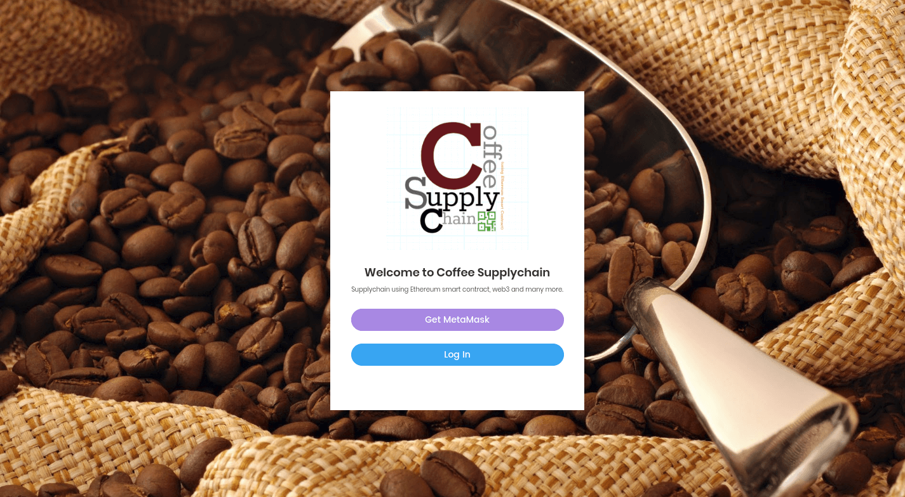

- Get MetaMask - You can go for this option if you don't have metamask wallet in your chrome or firefox browser and create your own ethereum wallet
- Log in - You can login to user or admin

#### Admin Dashboard
---


##### Admin Dashboard Displays
- Total Number of Users
- Total Roles
- Total Batches 
- Batches Overview 
- Your Address
- Storage Contract Address
- Product Supply Chain Contract Address 
- List of User Roles
- List of all Users in Product Supply Chain
- In admin dashboard you will be able to find out total users registered, total number of roles and total product batches created. 
- In batches overview section you will be able to find out the progress of each batch. 
- By clicking on button Create Batch , admin will be able to create new batch of product beans. 
- In below section of batches overview you can see your address ( admin wallet address), storage contract address, product supply chain contract address and user contract address. 
- Below all these addresses, on left side you can find out all the roles available in product supply chain and their slugs, on the right side you will find out all users list and their details. 
- Using Create User button  you can add new user into product supply chain.

#### Admin Activities
---
##### Create user
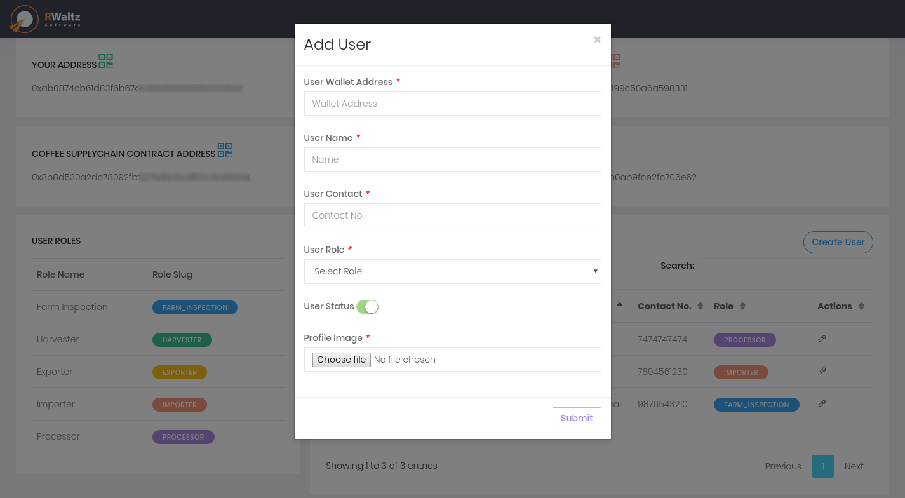

- Only admin can add new user in product supply chain
- In the Add User form admin have to provide basic information of user like User Wallet Address, Username, User Contact Number, Role of User , User Status means the user is activated or deactivated. 
- User can play his role and update information only if he is have activated status. 
- Admin also can provide profile image of user and after submitting form successfully.
- Admin can find out the newly added user in Users List on Admin dashboard.

##### Create New Batch
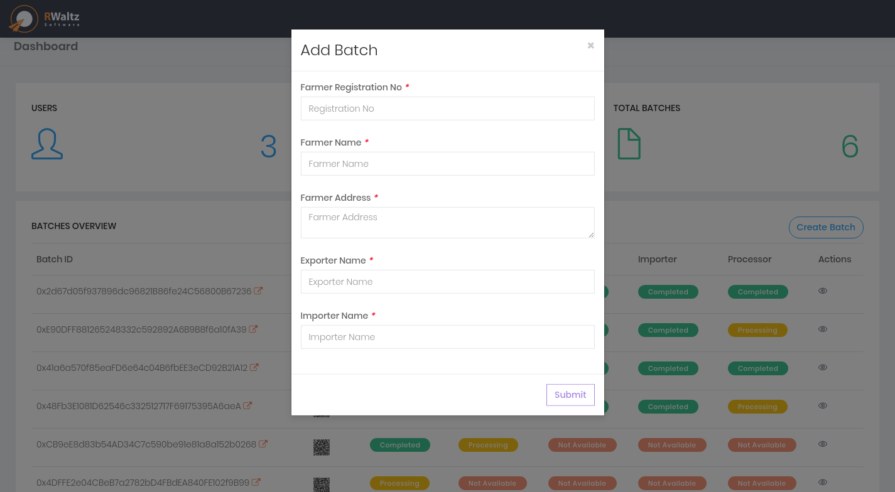

- To add new product beans batch, you can use create batch button in batches overview section in admin dashboard. 
- Here you have to provide basic information of batch like Farmer Registration Number , Farmer’s Name, Farmer’s Address, Exporter Name and Importer Name.
- By submitting Add Batch form you create new batch which can be updated by other roles later. 
- You can find out the details of particular batch in Actions column by pressing on eye icon ( view-batch page )

##### Batch Overview
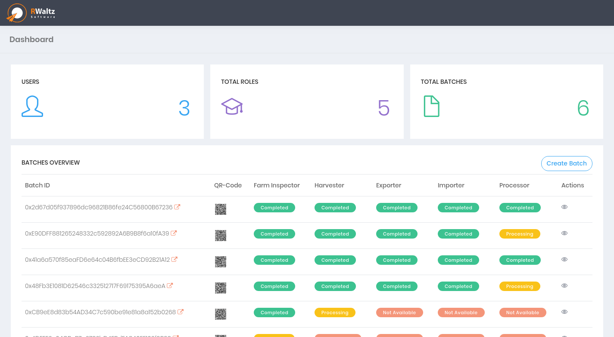

- Get all product batch information in batch overview. We get the in at what stage the batch is processing.You can find out progress of batch using eye icon ( view batch page).
- By clicking on the read arrow at the end of batch id, admin can find out the transaction details of that particular batch. 
- Similarly admin can also scan QR-code to find out the transaction details of batch. 
- Product Beans Batch States
- --- Processing  :  when the stage is in process
- --- completed   :  when the stage is completed by respective roles
- --- Not Available : Batch is not reached upto this stage

##### Batch Details
###### Batch all process completed
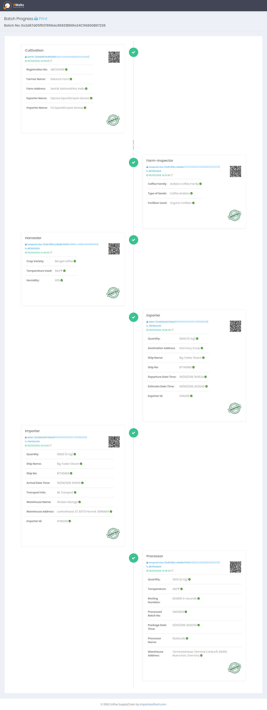

###### Batch work in progress


- In View Batch Page,/ admin will be able to see the progressive information of product batch. 
- Here we can get all details of each stage and also the name and address of user who updated the particular stage. 
---

#### User Dashboard
---
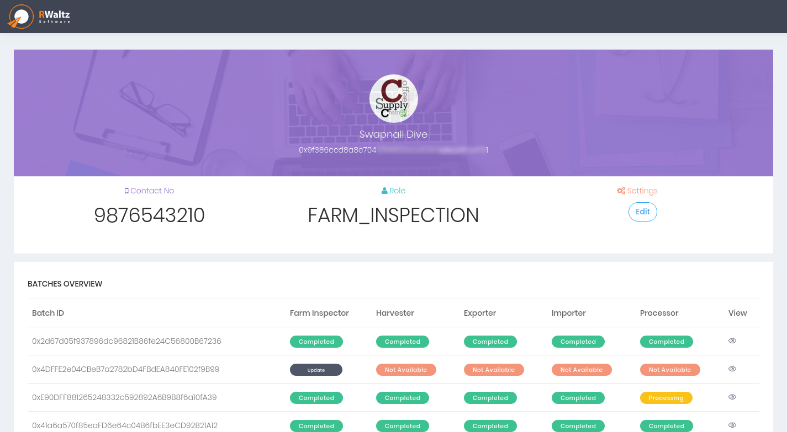

#### User Activities
---
##### Update User Profile
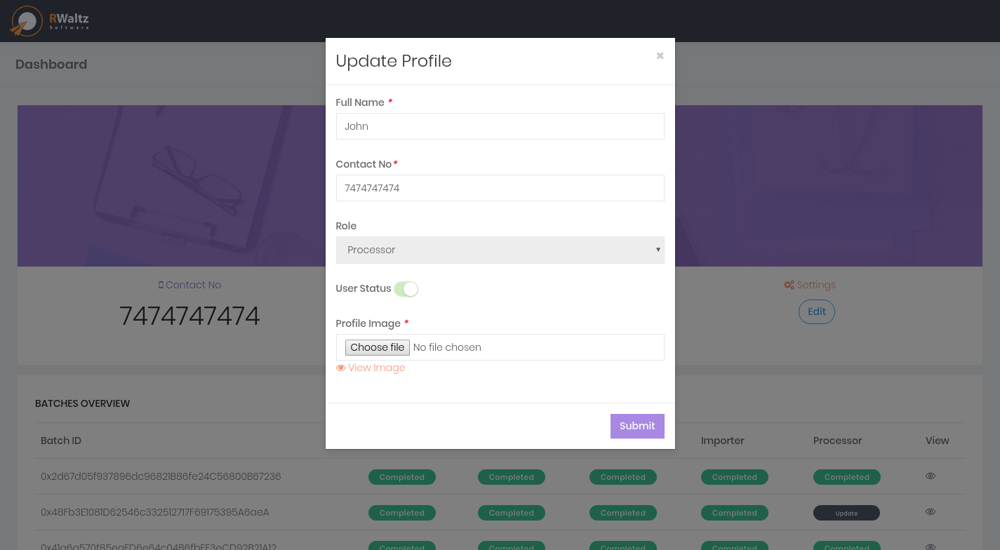

- To update , user profile you can use Update Profile form where you have to fill the information of user like full name of user, his / her contact number and profile image of user. 
- In this form role of user and user status can only be modified by admin, user can not edit this information.

###### Batch Updation by Farm-inspector
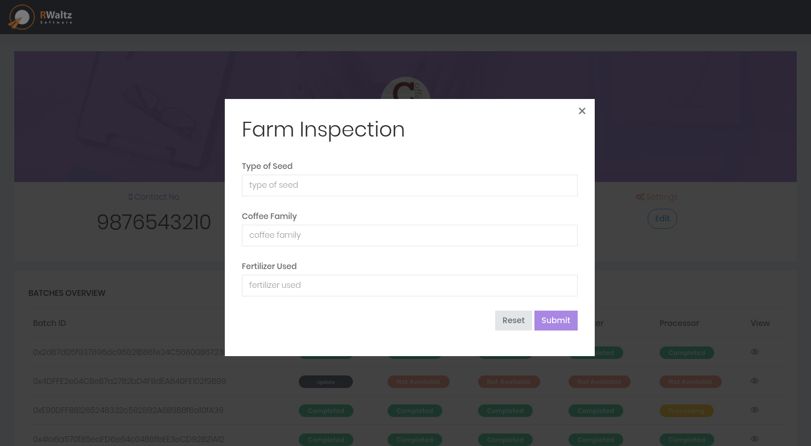

- To submit the farm inspection information, user’s having role of Farm inspector will be able to see the update button in batch overview.
- By pressing on update button farm inspector can update information by providing Type of Seed, Product Family and Fertilizer Used. 
- After successful submit of farm inspectors information batch progress to next step which is producing.

###### Batch Updation by Manufacturer


- Manufacturer grows product beans and after complete nourishing of product beans manufacturer makes the bean ready to export by updating Product Variety, Temperature and humidity to blockchain.

###### Batch Updation by Exporter
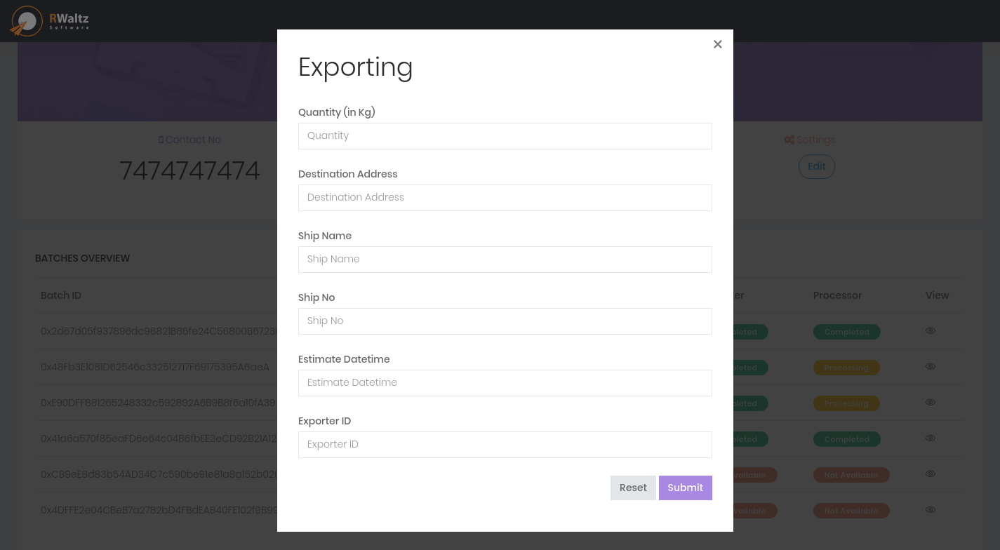

- Exporters sends the raw product beans for further process on beans as per demands and they update their own information to blockchain. 
- Once the product beans are ready to export, Users having role of Exporters updates the information of Exporting.
- It includes quantity, destination address, ship name, ship number , estimated datetime and exporter id.  
- By pressing submit button on the form, exporting information gets stored on blockchain.

###### Batch Updation by Importer
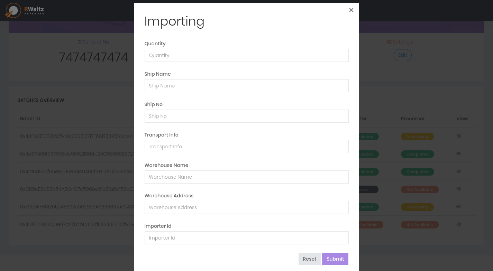

- Warehouses and Organizations who process on raw beans imports the raw product beans. While importing product beans they have to update their information on blockchain.
- Information of Quantity, Ship Name, Ship Number, Transporter Information, Warehouse Name , Warehouse Address and Importer’s Id Number. 
- After importing product beans, it goes for processing stage.

###### Batch Updation by DeliveryHub
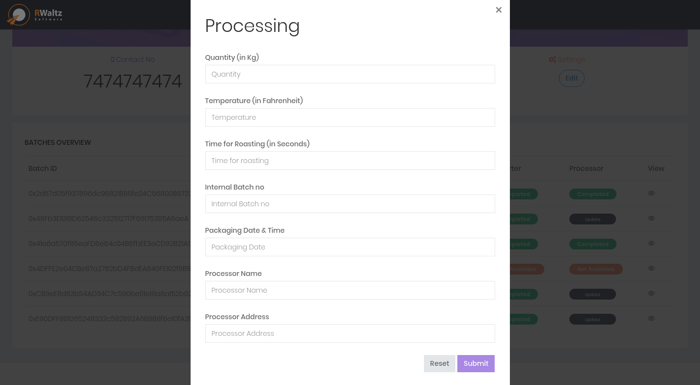

- At last the DeliveryHubs have to update the processing information like roasting temperature of product and get issued the quality certificate, product gets ready to sale out in markets.
- Processing have to fill the information of quantity, temperature, time for roasting, internal batch number, packaging date, deliveryHub name and address of deliveryHub. 
- And this is how the Product Supply Chain completes for one batch.

---

In this way, we can track the progress of product bean after each stage in blockchain. 

The stages which are yet not updated in blockchain are denoted using cross sign and the stages which are completed are denoted by right tick sign. 

You can also find out the name, address and contact information of user who updated the particular stage in product supply chain.

---
##### References:

Journey of Product - Blockchain Supply Chain - Provenance to Consumption: https://www.youtube.com/watch?v=YOr9A_TygBk

---
##### Video Links:

Introduction of Product Supply Chain : https://www.youtube.com/watch?v=t_MA40AZFVA&t=19s

Walk Through of Product Supply Chain Demo : https://www.youtube.com/watch?v=ksK9iv13_W4&t=54s

---
##### Todo:

- Truffle Tests